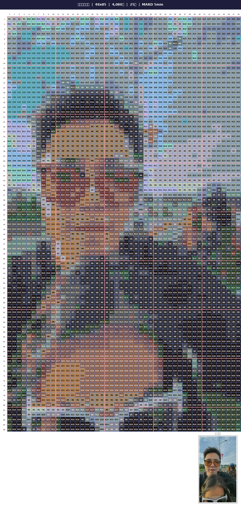
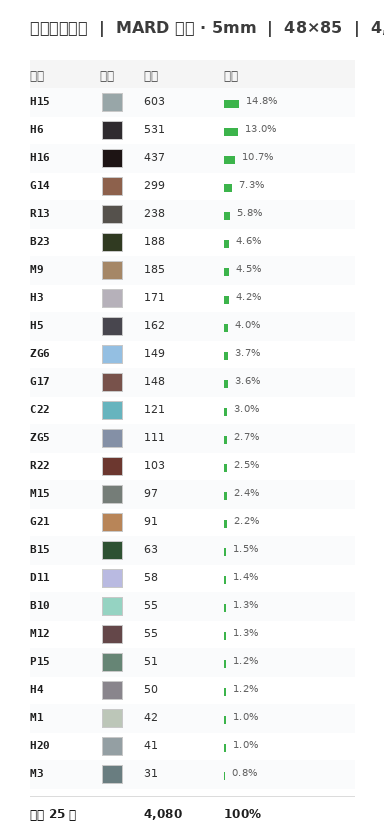

# 🧩 Bead Pattern Generator

照片转拼豆/Perler Bead 施工图纸生成器。支持 **6 个品牌、530 种颜色**，输出带色号标注的网格图纸 + 色号统计表。

<p align="center">
  
  
</p>

## 支持品牌

| 品牌 | 颜色数 | 珠子尺寸 | 说明 |
|------|--------|---------|------|
| 🟢 MARD | 291 | 5mm | 国产拼豆，颜色最全 |
| 🔵 Artkal S | 106 | 5mm | 性价比最高 |
| 🟡 Hama Midi | 46 | 5mm | 欧洲经典 |
| 🔴 Perler | 57 | 5mm | 北美普及 |
| 🟣 Nabbi | 30 | 5mm | 北欧环保 |

## 快速开始

```bash
# 安装依赖
pip install pillow numpy reportlab

# 生成施工图
python3 bead_generator.py \
  --input photo.jpg \
  --output ./output \
  --brand mard \
  --width 48
```

## 命令参数

```
--input      输入图片路径（必填）
--output     输出目录（必填）
--brand      品牌: mard|artkal|hama|perler|nabbi（默认 mard）
--width      网格宽度/格数（默认 48）
--bead-size  渲染像素大小（默认 20，128格建议 28-30）
--max-colors 最大颜色数（默认 30）
--no-labels  隐藏色号标注
```

## 输出文件

每次运行在输出目录生成 4 个文件：

- `pattern_*.png` — **施工图纸**：色块 + 色号标注 + 蓝色网格线 + 行列编号 + 标题栏
- `bom_*.png` — **色号统计表**：按颜色汇总，含数量/占比，买珠子参考
- `preview_*.png` — 纯颜色预览
- `bead_*.pdf` — 完整 PDF

## 尺寸建议

| 尺寸 | 格数 | 约颗数 | 成品大小 | 适合 |
|------|------|--------|---------|------|
| S | 29 | ~700 | 14.5cm | 冰箱贴/杯垫 |
| M | 48 | ~1,700 | 24cm | 小挂画 |
| L | 58 | ~2,500 | 29cm | 标准装饰画 |
| XL | 80 | ~5,000 | 40cm | 大画 |
| XXL | 128 | ~13,000 | 64cm | 大幅作品 |

## 色卡数据

色卡数据来自社区维护的 Reddit r/beadsprites 数据库，包含 6 个品牌共 530 种颜色的 RGB 映射。颜色匹配使用最近邻算法自动选择。

## AI Agent 使用

本项目可作为 Hermes Agent 技能安装：

```bash
git clone https://github.com/fengxiaoxu510-cpu/bead-pattern-generator.git \
  ~/.hermes/skills/creative/bead-pattern-generator/
```

安装后，对 Hermes 说「把这张照片转成拼豆图纸」即可自动触发交互流程。

## 技术栈

- Python 3.8+
- Pillow (图像处理)
- NumPy (颜色匹配)
- ReportLab (PDF 导出)

## License

MIT © 2026 Keen.F
